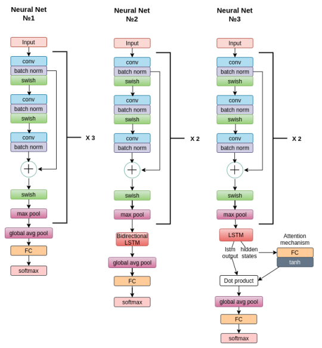
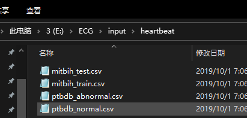
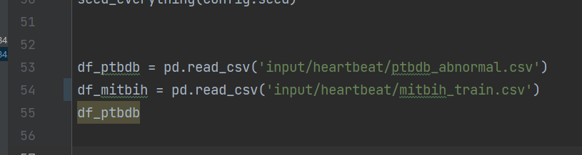

# ecg-classification
拷贝自：  
clone from: https://www.kaggle.com/code/polomarco/ecg-classification-cnn-lstm-attention-mechanism  
dataset：https://www.kaggle.com/code/polomarco/ecg-classification-cnn-lstm-attention-mechanism/input  
model：  
  

用的是:  
by using: CNN+LSTM+Attention mechanism  
  
环境：  
environment：8700k + 32G of RAM + GTX1060 6G   
others：requirements.txt  
data load：  

